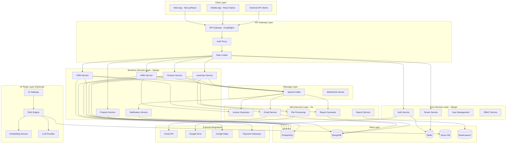
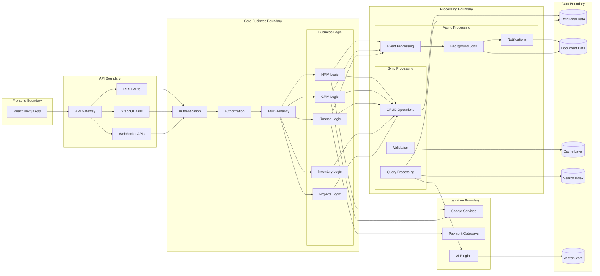
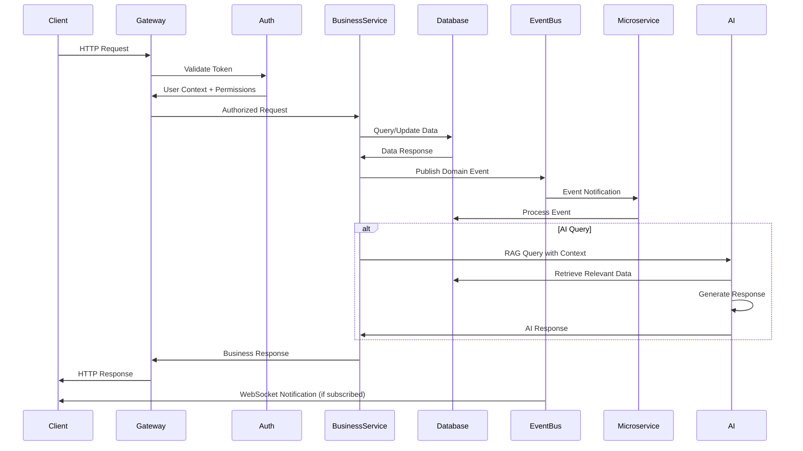
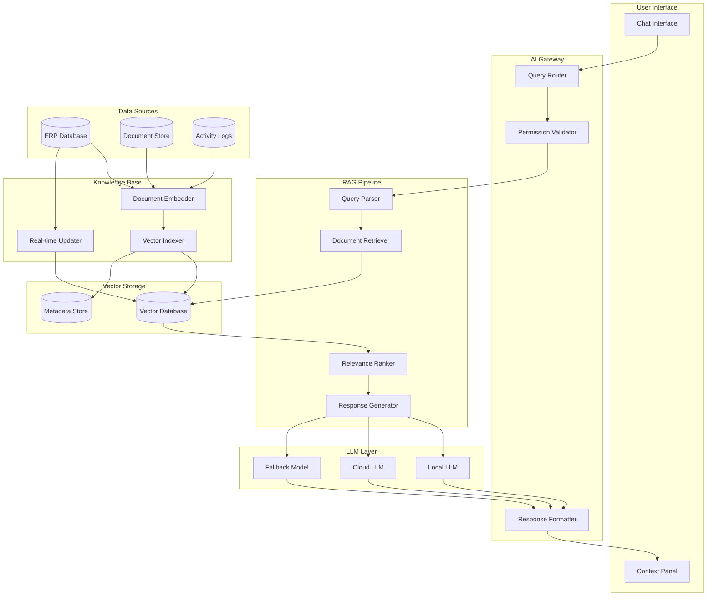
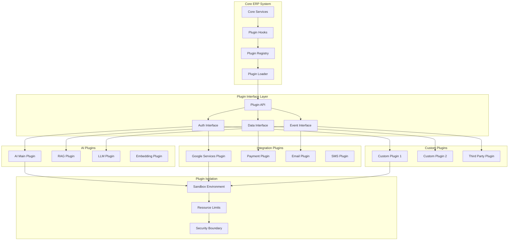
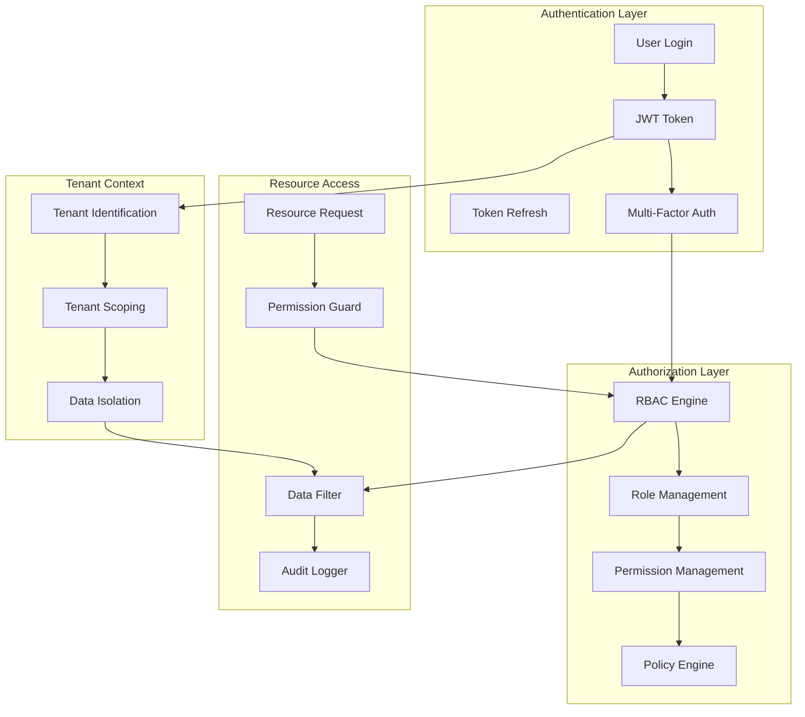

# High-Level Project Diagrams

## System Architecture Overview

## Service Boundaries and Interactions

## Data Flow Architecture

## RAG Integration Architecture

## Plugin System Architecture

## Multi-Tenant Data Isolation

```mermaid
graph TB
    subgraph "Application Layer"
        APP[Application Request]
        TENANT_RESOLVER[Tenant Resolver]
        CONTEXT[Tenant Context]
    end
    
    subgraph "Database Schema Isolation"
        SHARED_DB[(Shared Database)]
        
        subgraph "Tenant A Schema"
            SCHEMA_A[tenant_a]
            USERS_A[users]
            ORDERS_A[orders]
            INVOICES_A[invoices]
        end
        
        subgraph "Tenant B Schema"
            SCHEMA_B[tenant_b]
            USERS_B[users]
            ORDERS_B[orders]
            INVOICES_B[invoices]
        end
        
        subgraph "Shared Schema"
            SHARED[shared]
            TENANTS[tenants]
            PLUGINS[plugins]
            SYSTEM[system_config]
        end
    end
    
    subgraph "Cache Isolation"
        REDIS_CACHE[(Redis)]
        TENANT_A_CACHE[tenant_a:*]
        TENANT_B_CACHE[tenant_b:*]
        SHARED_CACHE[shared:*]
    end
    
    subgraph "Search Isolation"
        ELASTIC_SEARCH[(Elasticsearch)]
        INDEX_A[tenant_a_index]
        INDEX_B[tenant_b_index]
    end
    
    subgraph "Vector DB Isolation"
        VECTOR_DB[(Vector Database)]
        COLLECTION_A[tenant_a_vectors]
        COLLECTION_B[tenant_b_vectors]
    end
    
    APP --> TENANT_RESOLVER
    TENANT_RESOLVER --> CONTEXT
    
    CONTEXT --> SCHEMA_A
    CONTEXT --> SCHEMA_B
    CONTEXT --> SHARED
    
    CONTEXT --> TENANT_A_CACHE
    CONTEXT --> TENANT_B_CACHE
    CONTEXT --> SHARED_CACHE
    
    CONTEXT --> INDEX_A
    CONTEXT --> INDEX_B
    
    CONTEXT --> COLLECTION_A
    CONTEXT --> COLLECTION_B
```

## Security and RBAC Flow

This architecture provides a comprehensive view of the enterprise ERP system with clear separation of concerns, scalable microservices architecture, optional AI integration, and robust security measures.