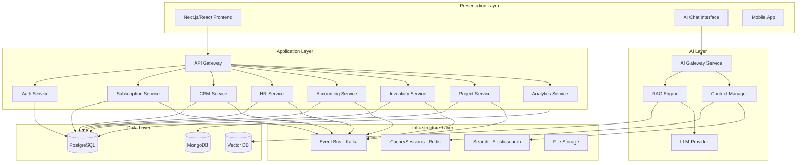

# Design Document

## Overview

The Intelligent ERP Suite is designed as a modern, AI-enhanced enterprise resource planning platform built on a microservices architecture. The system combines traditional ERP functionality with advanced AI capabilities through a RAG-enabled chatbot and contextual AI assistance throughout the user interface. The architecture follows Domain-Driven Design principles with clear separation between core business domains and cross-cutting AI services.

## Architecture

### High-Level Architecture

The system follows a three-tier architecture with AI services integrated as a cross-cutting layer:



### AI-Enhanced Architecture Components

#### AI Gateway Service
- **Purpose**: Central orchestrator for all AI interactions
- **Technology**: Python/FastAPI with async support
- **Responsibilities**:
  - Route AI requests to appropriate LLM providers
  - Manage conversation context and memory
  - Enforce role-based AI access control
  - Coordinate between RAG engine and business services
  - Handle AI action execution and validation

#### RAG Engine
- **Purpose**: Retrieval-Augmented Generation for contextual AI responses
- **Technology**: Python with LangChain/LlamaIndex
- **Components**:
  - Document ingestion pipeline
  - Vector embedding generation
  - Semantic search and retrieval
  - Context augmentation for LLM prompts
  - Real-time data synchronization

#### Context Manager
- **Purpose**: Maintain conversation state and user context
- **Technology**: Redis with custom Python service
- **Features**:
  - Session-based conversation memory
  - User preference and role context
  - Active module and record context
  - Cross-module data relationships

## Components and Interfaces

### Core Business Services

#### Authentication & Authorization Service
```python
# Core interfaces
class AuthService:
    def authenticate_user(self, credentials: UserCredentials) -> AuthToken
    def authorize_action(self, token: AuthToken, resource: str, action: str) -> bool
    def get_user_context(self, token: AuthToken) -> UserContext
    def manage_tenant_isolation(self, organization_id: str) -> TenantContext

class RBACManager:
    def check_permission(self, user: User, resource: str, action: str) -> bool
    def get_user_roles(self, user: User, organization: Organization) -> List[Role]
    def enforce_data_isolation(self, query: Query, organization_id: str) -> Query

#### Subscription & Billing Service Interface
```python
class SubscriptionService:
    def create_subscription(self, org_id: str, plan_id: str, payment_method: str) -> Subscription
    def upgrade_subscription(self, subscription_id: str, new_plan_id: str) -> Subscription
    def cancel_subscription(self, subscription_id: str, reason: str) -> Subscription
    def check_feature_access(self, org_id: str, feature: str) -> bool
    def track_usage(self, org_id: str, feature: str, quantity: int) -> UsageRecord
    def get_usage_summary(self, org_id: str, period: DateRange) -> UsageSummary

class BillingService:
    def generate_invoice(self, subscription_id: str, period: BillingPeriod) -> Invoice
    def process_payment(self, invoice_id: str) -> PaymentResult
    def handle_payment_failure(self, payment_id: str, reason: str) -> RetrySchedule
    def calculate_proration(self, subscription: Subscription, new_plan: Plan) -> ProrationAmount

class FeatureGateService:
    def check_access(self, org_id: str, feature: str) -> AccessResult
    def enforce_limits(self, org_id: str, resource: str, quantity: int) -> LimitResult
    def get_available_features(self, subscription: Subscription) -> List[Feature]
```

#### AI Gateway Service Interface
```python
class AIGatewayService:
    def process_chat_message(self, message: ChatMessage, context: UserContext) -> AIResponse
    def execute_ai_action(self, action: AIAction, context: UserContext) -> ActionResult
    def get_contextual_suggestions(self, ui_context: UIContext) -> List[Suggestion]
    def generate_content(self, template: ContentTemplate, data: Dict) -> GeneratedContent
    def perform_crud_operation(self, operation: CRUDRequest, context: UserContext) -> OperationResult

class RAGEngine:
    def retrieve_relevant_context(self, query: str, user_context: UserContext) -> List[Document]
    def generate_response(self, query: str, context: List[Document], user_context: UserContext) -> str
    def update_knowledge_base(self, documents: List[Document]) -> bool
```

#### CRM Service Interface
```python
class CRMService:
    def manage_contacts(self, operation: CRUDOperation) -> ContactResult
    def manage_leads(self, operation: CRUDOperation) -> LeadResult
    def manage_opportunities(self, operation: CRUDOperation) -> OpportunityResult
    def generate_sales_analytics(self, filters: AnalyticsFilters) -> SalesAnalytics
    def ai_lead_scoring(self, lead: Lead) -> LeadScore
    def ai_sales_forecast(self, parameters: ForecastParameters) -> SalesForecast
```

### AI Action Execution Framework

#### Action Types and Handlers
```python
class AIActionType(Enum):
    CRUD_OPERATION = "crud"
    NAVIGATION = "navigation"
    CONTENT_GENERATION = "content_generation"
    DATA_EXPORT = "data_export"
    REPORT_GENERATION = "report_generation"
    FORM_POPULATION = "form_population"
    FORECASTING = "forecasting"

class AIActionHandler:
    def validate_action(self, action: AIAction, context: UserContext) -> ValidationResult
    def execute_action(self, action: AIAction, context: UserContext) -> ActionResult
    def log_action(self, action: AIAction, result: ActionResult, context: UserContext) -> None

class CRUDActionHandler(AIActionHandler):
    def create_record(self, entity_type: str, data: Dict, context: UserContext) -> CreateResult
    def read_records(self, entity_type: str, filters: Dict, context: UserContext) -> ReadResult
    def update_record(self, entity_type: str, id: str, data: Dict, context: UserContext) -> UpdateResult
    def delete_record(self, entity_type: str, id: str, context: UserContext) -> DeleteResult
```

### Google Services Integration

#### Gmail Integration Service
```python
class GmailIntegrationService:
    def authenticate_gmail(self, user: User) -> GmailCredentials
    def sync_emails(self, user: User, filters: EmailFilters) -> List[Email]
    def send_email(self, email: EmailMessage, context: UserContext) -> SendResult
    def link_email_to_record(self, email: Email, record_id: str, record_type: str) -> bool

class DriveIntegrationService:
    def authenticate_drive(self, user: User) -> DriveCredentials
    def upload_document(self, document: Document, folder_path: str) -> DriveFile
    def sync_documents(self, user: User, folder_filters: List[str]) -> List[DriveFile]
    def share_document(self, file_id: str, permissions: SharePermissions) -> ShareResult
```

## Data Models

### Core Entity Models

#### User and Organization Models
```python
class Organization:
    id: UUID
    name: str
    domain: str
    settings: OrganizationSettings
    ai_config: AIConfiguration
    created_at: datetime
    updated_at: datetime

class User:
    id: UUID
    email: str
    password_hash: str
    organization_id: UUID
    profile: UserProfile
    ai_preferences: AIPreferences
    created_at: datetime
    last_login: datetime

class AIConfiguration:
    llm_provider: str  # "local_llama", "openai", "anthropic"
    model_name: str
    api_endpoint: Optional[str]
    api_key: Optional[str]
    rag_enabled: bool
    context_window_size: int
    temperature: float
```

#### AI-Specific Models
```python
class ChatConversation:
    id: UUID
    user_id: UUID
    organization_id: UUID
    title: str
    messages: List[ChatMessage]
    context: ConversationContext
    created_at: datetime
    updated_at: datetime

class ChatMessage:
    id: UUID
    conversation_id: UUID
    role: str  # "user", "assistant", "system"
    content: str
    metadata: MessageMetadata
    actions_performed: List[AIAction]
    timestamp: datetime

class AIAction:
    id: UUID
    type: AIActionType
    parameters: Dict
    result: Optional[ActionResult]
    user_id: UUID
    organization_id: UUID
    executed_at: datetime
    status: ActionStatus

class KnowledgeDocument:
    id: UUID
    organization_id: UUID
    title: str
    content: str
    document_type: str
    source_module: str
    source_record_id: Optional[UUID]
    embeddings: List[float]
    metadata: DocumentMetadata
    created_at: datetime
    updated_at: datetime
```

### Business Domain Models

#### Enhanced CRM Models with AI Features
```python
class Contact:
    id: UUID
    organization_id: UUID
    name: str
    email: str
    phone: str
    company: Optional[str]
    ai_insights: ContactInsights
    interaction_history: List[Interaction]
    created_at: datetime
    updated_at: datetime

class ContactInsights:
    engagement_score: float
    predicted_value: Optional[float]
    next_best_action: Optional[str]
    communication_preferences: Dict
    last_updated: datetime

class Lead:
    id: UUID
    organization_id: UUID
    contact_id: UUID
    source: str
    status: LeadStatus
    ai_score: LeadScore
    predicted_conversion_date: Optional[datetime]
    recommended_actions: List[str]
    created_at: datetime
    updated_at: datetime

class LeadScore:
    score: float  # 0-100
    confidence: float
    factors: List[ScoringFactor]
    last_calculated: datetime
```

## Error Handling

### AI-Specific Error Handling

#### Error Types and Recovery Strategies
```python
class AIErrorType(Enum):
    LLM_UNAVAILABLE = "llm_unavailable"
    CONTEXT_LIMIT_EXCEEDED = "context_limit_exceeded"
    PERMISSION_DENIED = "permission_denied"
    ACTION_VALIDATION_FAILED = "action_validation_failed"
    RAG_RETRIEVAL_FAILED = "rag_retrieval_failed"

class AIErrorHandler:
    def handle_llm_unavailable(self, context: UserContext) -> FallbackResponse
    def handle_context_limit(self, conversation: ChatConversation) -> ConversationSummary
    def handle_permission_denied(self, action: AIAction, context: UserContext) -> ErrorResponse
    def handle_action_failure(self, action: AIAction, error: Exception) -> RecoveryAction

class FallbackStrategies:
    def use_cached_response(self, query: str, context: UserContext) -> Optional[str]
    def switch_to_basic_mode(self, context: UserContext) -> BasicModeResponse
    def queue_for_retry(self, action: AIAction, delay: int) -> bool
```

### System Resilience Patterns

#### Circuit Breaker for AI Services
```python
class AICircuitBreaker:
    def __init__(self, failure_threshold: int = 5, recovery_timeout: int = 60):
        self.failure_threshold = failure_threshold
        self.recovery_timeout = recovery_timeout
        self.failure_count = 0
        self.last_failure_time = None
        self.state = CircuitState.CLOSED

    def call_ai_service(self, service_call: Callable) -> Any:
        if self.state == CircuitState.OPEN:
            if self._should_attempt_reset():
                self.state = CircuitState.HALF_OPEN
            else:
                raise CircuitBreakerOpenException()
        
        try:
            result = service_call()
            self._on_success()
            return result
        except Exception as e:
            self._on_failure()
            raise e
```

## Testing Strategy

### AI Component Testing

#### Unit Testing for AI Services
```python
class TestAIGateway:
    def test_chat_message_processing(self):
        # Test basic chat functionality
        # Mock LLM responses
        # Verify context handling
        pass
    
    def test_action_execution_validation(self):
        # Test permission checking
        # Test action parameter validation
        # Test execution logging
        pass
    
    def test_rag_context_retrieval(self):
        # Test document retrieval
        # Test context relevance scoring
        # Test embedding generation
        pass

class TestAIActions:
    def test_crud_operations(self):
        # Test create, read, update, delete via AI
        # Test permission enforcement
        # Test data validation
        pass
    
    def test_content_generation(self):
        # Test form field population
        # Test document generation
        # Test template processing
        pass
```

#### Integration Testing
```python
class TestAIIntegration:
    def test_end_to_end_conversation(self):
        # Test complete conversation flow
        # Test context persistence
        # Test action execution
        pass
    
    def test_multi_module_actions(self):
        # Test actions spanning multiple modules
        # Test data consistency
        # Test transaction handling
        pass
    
    def test_google_services_integration(self):
        # Test Gmail/Drive integration
        # Test OAuth flow
        # Test data synchronization
        pass
```

### Performance Testing for AI Components

#### Load Testing Strategy
```python
class AIPerformanceTests:
    def test_concurrent_chat_sessions(self):
        # Test multiple simultaneous conversations
        # Measure response times
        # Test resource utilization
        pass
    
    def test_rag_retrieval_performance(self):
        # Test vector search performance
        # Test embedding generation speed
        # Test context assembly time
        pass
    
    def test_action_execution_throughput(self):
        # Test bulk action processing
        # Test database operation performance
        # Test event publishing latency
        pass
```

## Security Considerations

### AI-Specific Security Measures

#### Data Privacy and Access Control
```python
class AISecurityManager:
    def sanitize_ai_input(self, input_text: str, context: UserContext) -> str:
        # Remove sensitive information
        # Validate input format
        # Check for injection attempts
        pass
    
    def filter_ai_response(self, response: str, context: UserContext) -> str:
        # Remove unauthorized information
        # Apply data masking rules
        # Ensure compliance with privacy policies
        pass
    
    def audit_ai_interaction(self, interaction: AIInteraction) -> AuditLog:
        # Log all AI interactions
        # Track data access patterns
        # Monitor for anomalous behavior
        pass
```

#### Prompt Injection Prevention
```python
class PromptSecurityValidator:
    def validate_user_input(self, input_text: str) -> ValidationResult:
        # Check for prompt injection patterns
        # Validate against known attack vectors
        # Apply input sanitization
        pass
    
    def construct_secure_prompt(self, user_query: str, context: List[Document]) -> str:
        # Build prompt with proper boundaries
        # Include security instructions
        # Limit context exposure
        pass
```

## Deployment Architecture

### Containerized Deployment Strategy

#### Docker Configuration
```yaml
# AI Gateway Service
ai-gateway:
  image: intelligent-erp/ai-gateway:latest
  environment:
    - LLM_PROVIDER=local_llama
    - VECTOR_DB_URL=http://qdrant:6333
    - REDIS_URL=redis://redis:6379
  depends_on:
    - redis
    - qdrant
    - postgresql

# RAG Engine Service
rag-engine:
  image: intelligent-erp/rag-engine:latest
  environment:
    - EMBEDDING_MODEL=sentence-transformers/all-MiniLM-L6-v2
    - VECTOR_DB_URL=http://qdrant:6333
  volumes:
    - ./models:/app/models
  depends_on:
    - qdrant

# Vector Database
qdrant:
  image: qdrant/qdrant:latest
  ports:
    - "6333:6333"
  volumes:
    - qdrant_data:/qdrant/storage
```

### Scaling Strategy

#### Horizontal Scaling for AI Services
```python
class AIServiceScaler:
    def scale_based_on_load(self, metrics: ServiceMetrics) -> ScalingDecision:
        # Monitor conversation volume
        # Track response times
        # Scale AI gateway instances
        pass
    
    def manage_llm_resources(self, usage_patterns: UsagePatterns) -> ResourceAllocation:
        # Allocate GPU resources
        # Manage model loading
        # Optimize memory usage
        pass
```

This design provides a comprehensive foundation for building the Intelligent ERP Suite with advanced AI capabilities while maintaining security, scalability, and maintainability.