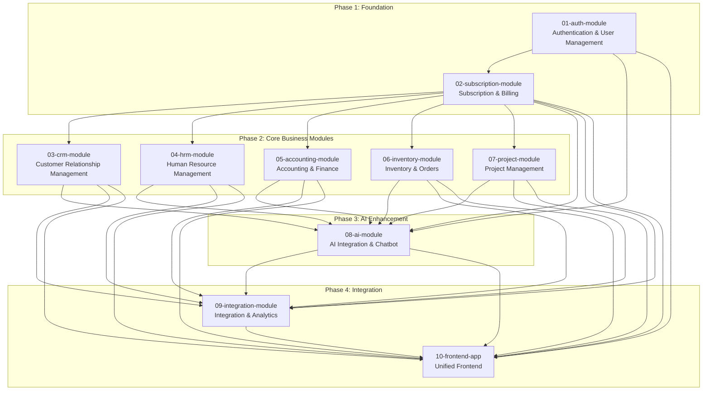

# ERP Module Specifications - Complete Overview

## 📋 Module Development Summary

This document provides a comprehensive overview of all 8 ERP modules, their specifications, dependencies, and integration points.

## 🏗️ Module Architecture Overview



## 📊 Module Specifications Matrix

| Module | Timeline | Team Size | Tech Stack | Database | Key Features |
|--------|----------|-----------|------------|----------|--------------|
| **01-Auth** | Months 1-2 | 2-3 devs | Django REST API | PostgreSQL | Multi-tenant auth, RBAC, JWT tokens |
| **02-Subscription** | Month 3 | 3-4 devs | Django REST API + Celery | PostgreSQL + Redis | Subscription mgmt, Billing, Usage tracking, Feature gating |
| **03-CRM** | Months 4-5 | 3-4 devs | Django REST API | PostgreSQL | Contact mgmt, Lead pipeline, Sales analytics |
| **04-HRM** | Months 6-7 | 3-4 devs | Django REST API | PostgreSQL | Employee directory, Leave mgmt, Attendance |
| **05-Accounting** | Months 8-9 | 3-4 devs | Django REST API | PostgreSQL | Chart of accounts, Invoicing, Financial reports |
| **06-Inventory** | Months 10-11 | 3-4 devs | Django REST API | PostgreSQL | Product catalog, Stock mgmt, Order processing |
| **07-Project** | Months 12-13 | 2-3 devs | Django REST API | PostgreSQL | Task mgmt, Time tracking, Resource allocation |
| **08-AI** | Months 14-16 | 4-5 devs | FastAPI + Python | PostgreSQL + Vector DB | AI chatbot, RAG, Predictive analytics |
| **09-Integration** | Months 17-19 | 3-4 devs | Django + FastAPI | PostgreSQL + MongoDB | Unified analytics, Third-party integrations |
| **10-Frontend** | Months 2-19 | 4-5 devs | Next.js + TypeScript | API Integration | Unified UI, Real-time updates, Responsive design |

## 🔗 Module Dependencies & Integration

### Dependency Chain
```
01-auth-module (Foundation)
└── 02-subscription-module (SaaS Foundation)
    ├── 03-crm-module
    ├── 04-hrm-module
    ├── 05-accounting-module
    ├── 06-inventory-module
    └── 07-project-module
        └── 08-ai-module (Integrates with ALL)
            └── 09-integration-module (Unifies ALL)
```

### Integration Matrix

| Module | Auth | CRM | HRM | Accounting | Inventory | Project | AI | Integration |
|--------|------|-----|-----|------------|-----------|---------|----|-----------| 
| **Auth** | - | ✅ | ✅ | ✅ | ✅ | ✅ | ✅ | ✅ |
| **CRM** | ✅ | - | 🔄 | 🔄 | 🔄 | 🔄 | ✅ | ✅ |
| **HRM** | ✅ | 🔄 | - | 🔄 | 🔄 | ✅ | ✅ | ✅ |
| **Accounting** | ✅ | ✅ | 🔄 | - | ✅ | 🔄 | ✅ | ✅ |
| **Inventory** | ✅ | 🔄 | 🔄 | ✅ | - | 🔄 | ✅ | ✅ |
| **Project** | ✅ | 🔄 | ✅ | 🔄 | 🔄 | - | ✅ | ✅ |
| **AI** | ✅ | ✅ | ✅ | ✅ | ✅ | ✅ | - | ✅ |
| **Integration** | ✅ | ✅ | ✅ | ✅ | ✅ | ✅ | ✅ | - |

**Legend**: ✅ Direct Integration | 🔄 Optional Integration | - Self

## 📋 Detailed Module Specifications

### 🔐 Module 1: Authentication & User Management
**Repository**: `erp-auth-service`  
**Status**: Foundation module - must be completed first

#### Core Features
- Multi-tenant organization management
- JWT-based authentication
- Role-based access control (Admin, Staff, Vendor)
- User profile management
- Token validation for other services

#### Technical Stack
- **Backend**: Django 4.2+ + DRF + SimpleJWT
- **Database**: PostgreSQL 15+
- **Cache**: Redis 7.0+
- **API**: RESTful with OpenAPI documentation

#### Key APIs
- `/api/auth/register` - Organization and user registration
- `/api/auth/login` - User authentication
- `/api/auth/validate` - Token validation for other services
- `/api/users/` - User management
- `/api/organizations/` - Organization management
- `/api/roles/` - Role and permission management

---

### 💳 Module 2: Subscription & Billing Management
**Repository**: `erp-subscription-service`  
**Dependencies**: `erp-auth-service`

#### Core Features
- Subscription plan management with versioning
- Multi-provider payment processing (Stripe, PayPal, etc.)
- Usage tracking and metering across all ERP modules
- Feature gating and access control enforcement
- Trial management and conversion optimization
- Customer self-service billing portal
- Comprehensive billing analytics and reporting
- Automated dunning and payment retry logic

#### Technical Stack
- **Backend**: Django 4.2+ + DRF + Celery
- **Payment**: Stripe API, PayPal API, Square API
- **Database**: PostgreSQL (billing data) + Redis (caching)
- **Queue**: Celery + Redis for async processing
- **API**: RESTful with OpenAPI documentation

#### Key APIs
- `/api/subscriptions/` - Subscription lifecycle management
- `/api/billing/` - Billing and invoice management
- `/api/payments/` - Payment processing and methods
- `/api/usage/` - Usage tracking and limits
- `/api/plans/` - Subscription plan management
- `/api/features/` - Feature access control
- `/api/analytics/` - Billing analytics and reports

#### SaaS Features
- **Multi-tier Pricing**: Starter, Professional, Enterprise plans
- **Usage-based Billing**: Track API calls, storage, users
- **Feature Gating**: Control access to CRM, HRM, Accounting modules
- **Trial Management**: 14-day free trials with conversion tracking
- **Proration**: Automatic billing adjustments for plan changes
- **Dunning Management**: Automated payment retry and notifications

---

### 👥 Module 3: Customer Relationship Management (CRM)
**Repository**: `erp-crm-service`  
**Dependencies**: `erp-auth-service`, `erp-subscription-service`

#### Core Features
- Contact and company database
- Lead management with pipeline
- Opportunity tracking
- Sales analytics and forecasting
- Activity and communication tracking

#### Technical Stack
- **Backend**: Django 4.2+ + DRF
- **Database**: PostgreSQL (separate CRM database)
- **Cache**: Redis 7.0+ (shared)
- **API**: RESTful with OpenAPI documentation

#### Key APIs
- `/api/crm/contacts/` - Contact management
- `/api/crm/companies/` - Company management
- `/api/crm/leads/` - Lead pipeline management
- `/api/crm/opportunities/` - Opportunity tracking
- `/api/crm/activities/` - Activity logging

---

### 🏢 Module 4: Human Resource Management (HRM)
**Repository**: `erp-hrm-service`  
**Dependencies**: `erp-auth-service`, `erp-subscription-service`

#### Core Features
- Employee directory and profiles
- Department and role management
- Leave request and approval system
- Attendance tracking
- Basic payroll calculations

#### Technical Stack
- **Backend**: Django 4.2+ + DRF
- **Frontend**: Next.js 14+ + React Calendar
- **Database**: PostgreSQL (extends auth DB)
- **Scheduling**: React Calendar components

#### Key APIs
- `/api/hrm/employees/` - Employee management
- `/api/hrm/departments/` - Department structure
- `/api/hrm/leaves/` - Leave management
- `/api/hrm/attendance/` - Attendance tracking
- `/api/hrm/payroll/` - Payroll calculations

---

### 💰 Module 5: Accounting & Finance
**Repository**: `erp-accounting-service`  
**Dependencies**: `erp-auth-service`, `erp-subscription-service`, optional integration with `erp-crm-service`

#### Core Features
- Chart of accounts management
- Invoice creation and management
- Payment tracking and reconciliation
- Financial reports (P&L, Balance Sheet)
- Tax calculations and compliance

#### Technical Stack
- **Backend**: Django 4.2+ + DRF
- **Frontend**: Next.js 14+ + React-PDF
- **Database**: PostgreSQL (extends auth DB)
- **PDF**: React-PDF for invoice generation

#### Key APIs
- `/api/accounting/accounts/` - Chart of accounts
- `/api/accounting/invoices/` - Invoice management
- `/api/accounting/payments/` - Payment tracking
- `/api/accounting/reports/` - Financial reporting
- `/api/accounting/taxes/` - Tax management

---

### 📦 Module 6: Inventory & Order Management
**Repository**: `erp-inventory-service`  
**Dependencies**: `erp-auth-service`, `erp-subscription-service`, optional integration with `erp-accounting-service`

#### Core Features
- Product catalog with categories
- Multi-warehouse stock management
- Purchase and sales order processing
- Stock level monitoring and alerts
- Barcode scanning support

#### Technical Stack
- **Backend**: Django 4.2+ + DRF
- **Frontend**: Next.js 14+ + Barcode Scanner
- **Database**: PostgreSQL (extends auth DB)
- **Barcode**: React barcode scanning

#### Key APIs
- `/api/inventory/products/` - Product catalog
- `/api/inventory/warehouses/` - Warehouse management
- `/api/inventory/stock/` - Stock tracking
- `/api/inventory/orders/` - Order processing
- `/api/inventory/reports/` - Inventory reports

---

### 📊 Module 7: Project Management
**Repository**: `erp-project-service`  
**Dependencies**: `erp-auth-service`, `erp-subscription-service`, optional integration with `erp-hrm-service`

#### Core Features
- Project creation and management
- Task assignment and tracking
- Time tracking and timesheets
- Resource allocation and planning
- Project analytics and reporting

#### Technical Stack
- **Backend**: Django 4.2+ + DRF
- **Frontend**: Next.js 14+ + Gantt Charts
- **Database**: PostgreSQL (extends auth DB)
- **Charts**: React Gantt components

#### Key APIs
- `/api/projects/` - Project management
- `/api/projects/tasks/` - Task tracking
- `/api/projects/timesheets/` - Time tracking
- `/api/projects/resources/` - Resource allocation
- `/api/projects/reports/` - Project analytics

---

### 🤖 Module 8: AI Integration & Chatbot
**Repository**: `erp-ai-service`  
**Dependencies**: ALL previous modules for data access

#### Core Features
- AI chatbot with natural language processing
- RAG (Retrieval-Augmented Generation) capabilities
- Predictive analytics across all modules
- Intelligent automation workflows
- Multi-LLM provider support (OpenAI, Local Llama, Anthropic)

#### Technical Stack
- **Backend**: FastAPI + Python + LangChain
- **AI**: OpenAI API, Local LLM, Anthropic
- **Vector DB**: Qdrant for embeddings
- **Frontend**: React chat components

#### Key APIs
- `/api/ai/chat/` - Chatbot interactions
- `/api/ai/analytics/` - Predictive analytics
- `/api/ai/automation/` - Workflow automation
- `/api/ai/models/` - LLM model management
- `/api/ai/rag/` - RAG system management

---

### 🔗 Module 9: Integration & Analytics
**Repository**: `erp-integration-service`  
**Dependencies**: ALL modules for unified experience

#### Core Features
- Unified analytics dashboard
- Cross-module reporting and insights
- Third-party integrations (Google, Slack, etc.)
- Data import/export tools
- Advanced business intelligence

#### Technical Stack
- **Backend**: Django + FastAPI hybrid
- **Frontend**: Next.js + Advanced charting
- **Database**: PostgreSQL + MongoDB
- **Integration**: REST APIs + Webhooks

#### Key APIs
- `/api/integration/dashboard/` - Unified dashboard
- `/api/integration/reports/` - Cross-module reports
- `/api/integration/connectors/` - Third-party integrations
- `/api/integration/exports/` - Data export tools
- `/api/integration/analytics/` - Business intelligence

## 🚀 Development Strategy

### Phase-Based Development
1. **Foundation Phase** (Months 1-2): Complete auth module
2. **Core Business Phase** (Months 3-12): Develop business modules sequentially
3. **AI Enhancement Phase** (Months 13-15): Add AI capabilities
4. **Integration Phase** (Months 16-18): Unify and enhance

### Parallel Development Opportunities
- **Months 3-12**: Multiple teams can work on different business modules simultaneously after auth is complete
- **Months 13-15**: AI team can start while business modules are being finalized
- **Months 16-18**: Integration team can begin work as modules are completed

### Quality Assurance
- Each module must achieve >90% test coverage
- API response times must be <300ms
- All modules must pass security audits
- User acceptance testing for each module

## 📈 Success Metrics

### Technical Metrics
- **Performance**: API response times, page load speeds
- **Quality**: Test coverage, bug reports, code quality scores
- **Security**: Security audit results, vulnerability assessments
- **Scalability**: Concurrent user support, database performance

### Business Metrics
- **User Adoption**: Active users per module, feature usage
- **Productivity**: Time savings, process improvements
- **Revenue Impact**: Sales increase, cost reduction
- **Customer Satisfaction**: User feedback, support tickets

## 🔄 Integration Patterns

### Authentication Integration
All modules integrate with the auth module for:
- User authentication and session management
- Role-based access control
- Organization-based data isolation
- User assignment and ownership

### Data Integration
Modules can share data through:
- Direct API calls for real-time data
- Event-driven updates for data synchronization
- Shared database views for reporting
- Export/import for data migration

### UI Integration
- Consistent design system across all modules
- Shared navigation and layout components
- Unified user experience
- Cross-module navigation and deep linking

This modular approach enables focused development, reduced risk, and faster time to market while maintaining the flexibility to integrate modules as needed.