# Application Flow Documentation

## Request Flow Overview

This document describes how requests move across the frontend, backend services, databases, and AI layer in the enterprise ERP system.

## 1. Standard Business Request Flow

### User Authentication Flow
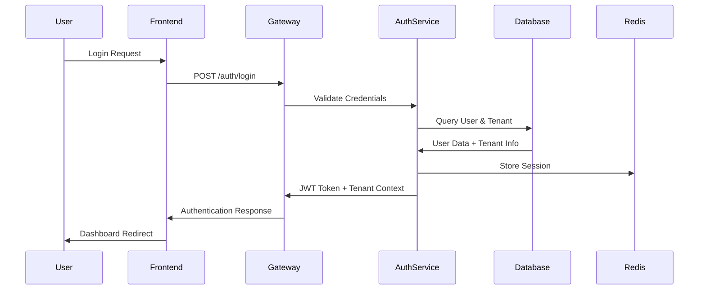

### CRUD Operation Flow
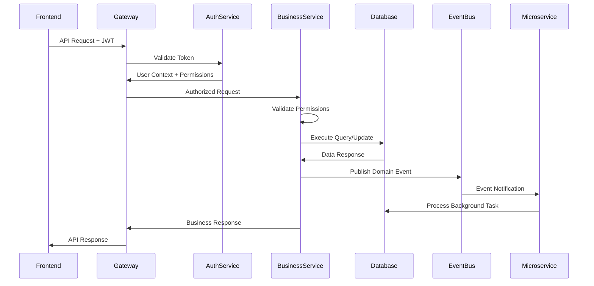

## 2. GraphQL Query Flow

### Complex Data Retrieval
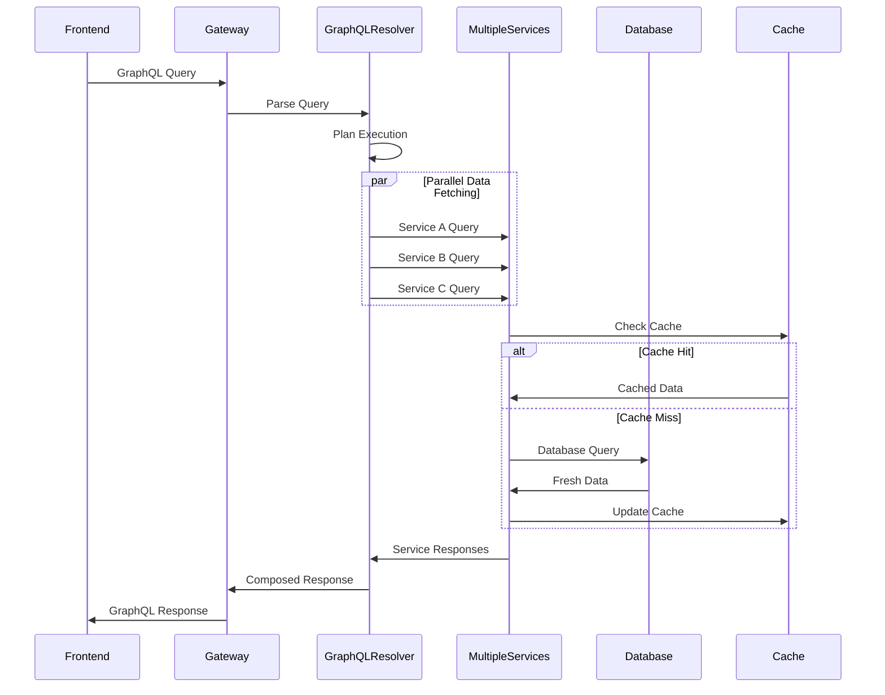

## 3. Real-Time Communication Flow

### WebSocket Event Flow
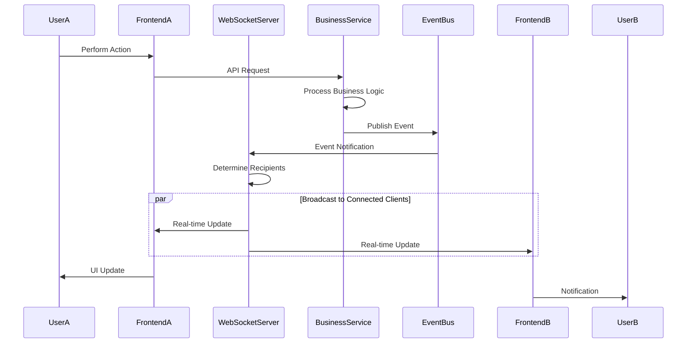

## 4. AI-Enhanced Request Flow

### AI Chatbot Query Processing
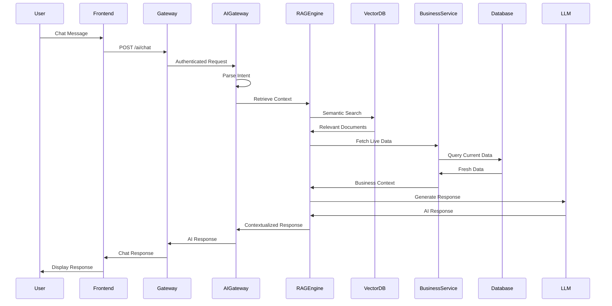

### AI Action Execution Flow
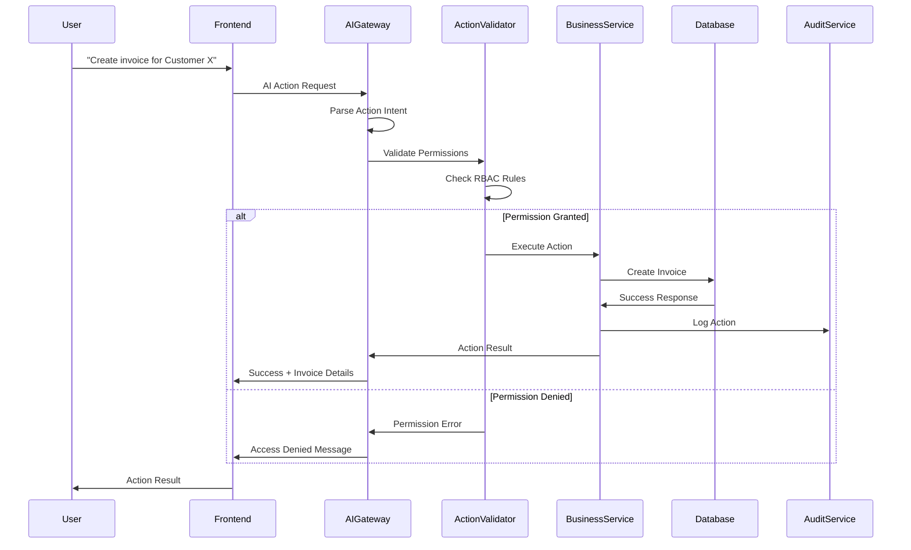

## 5. Multi-Tenant Request Processing

### Tenant-Aware Data Access
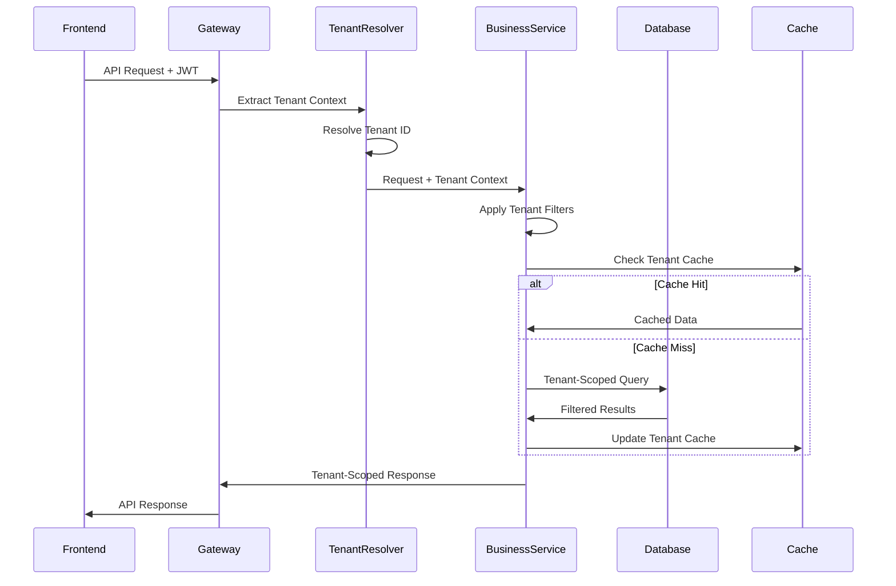

## 6. Background Job Processing Flow

### Asynchronous Task Execution
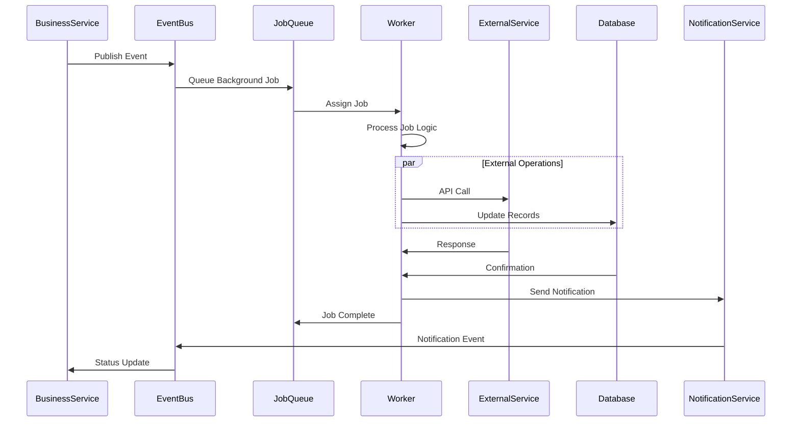

## 7. File Upload and Processing Flow

### Document Management Flow
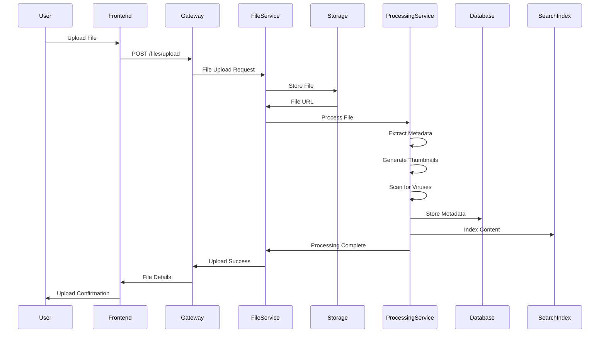

## 8. External Integration Flow

### Google Services Integration
```mermaid
sequenceDiagram
    participant User
    participant Frontend
    participant Gateway
    participant BusinessService
    participant GooglePlugin
    parameter GoogleAPI
    participant Database
    
    User->>Frontend: "Send invoice via Gmail"
    Frontend->>Gateway: Integration Request
    Gateway->>BusinessService: Process Request
    
    BusinessService->>GooglePlugin: Gmail Send Request
    GooglePlugin->>GooglePlugin: Check OAuth Token
    
    alt Token Valid
        GooglePlugin->>GoogleAPI: Send Email
        GoogleAPI->>GooglePlugin: Success Response
    else Token Expired
        GooglePlugin->>GoogleAPI: Refresh Token
        GoogleAPI->>GooglePlugin: New Token
        GooglePlugin->>GoogleAPI: Send Email
        GoogleAPI->>GooglePlugin: Success Response
    end
    
    GooglePlugin->>Database: Log Integration Activity
    GooglePlugin->>BusinessService: Integration Result
    BusinessService->>Gateway: Response
    Gateway->>Frontend: Success Message
    Frontend->>User: Email Sent Confirmation
```

## 9. Error Handling and Recovery Flow

### Circuit Breaker Pattern
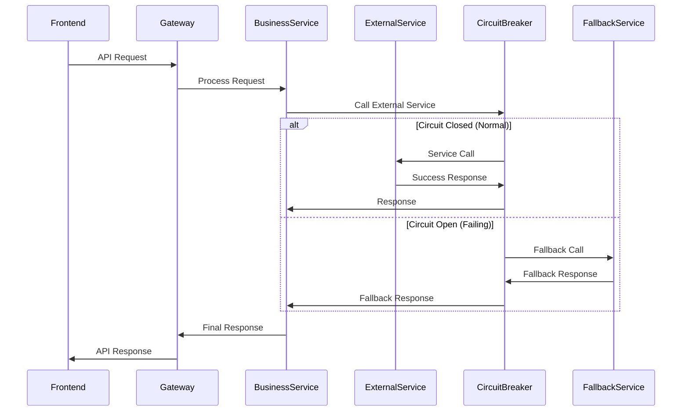

## 10. Performance Optimization Flow

### Caching Strategy
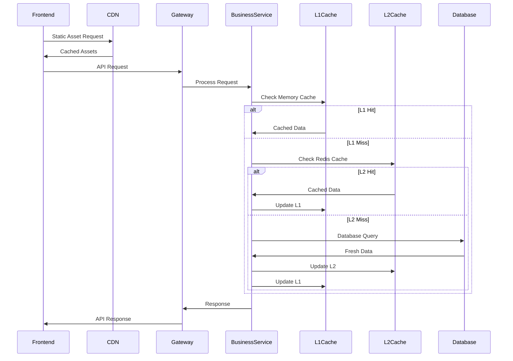

This comprehensive application flow documentation covers all major request patterns in the enterprise ERP system, from simple CRUD operations to complex AI-enhanced workflows, ensuring clear understanding of how data moves through the system.