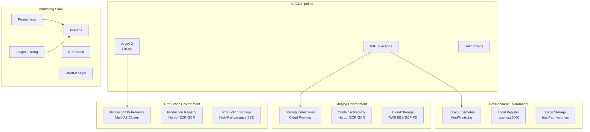

# Kubernetes-Based Infrastructure Plan for Intelligent ERP Suite

## 🎯 Executive Summary

This document outlines a comprehensive **Kubernetes-based, Docker-first infrastructure strategy** for the Intelligent ERP Suite. The plan transforms the current development approach into a production-ready, scalable, cloud-native architecture while maintaining the excellent dev-first experience.

## 🏗️ Architecture Overview

### High-Level Infrastructure Architecture

This comprehensive Kubernetes infrastructure plan provides a scalable, production-ready foundation for the Intelligent ERP Suite while maintaining the excellent developer experience.